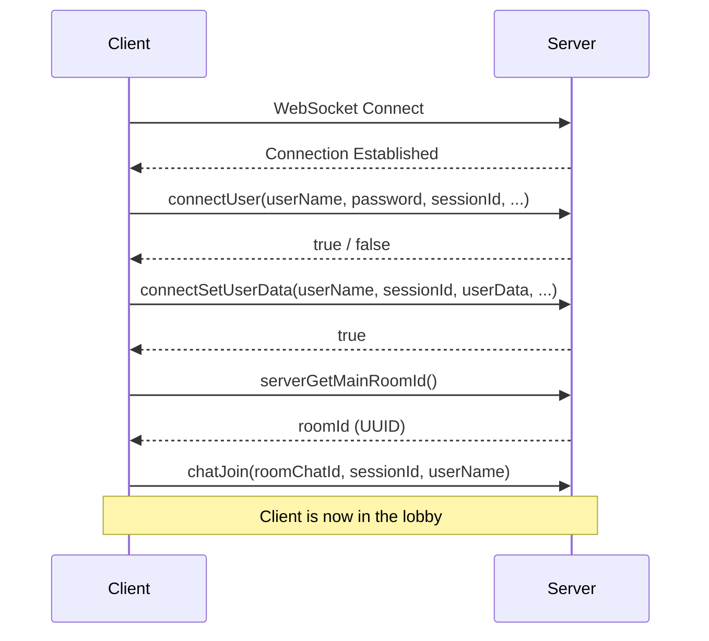
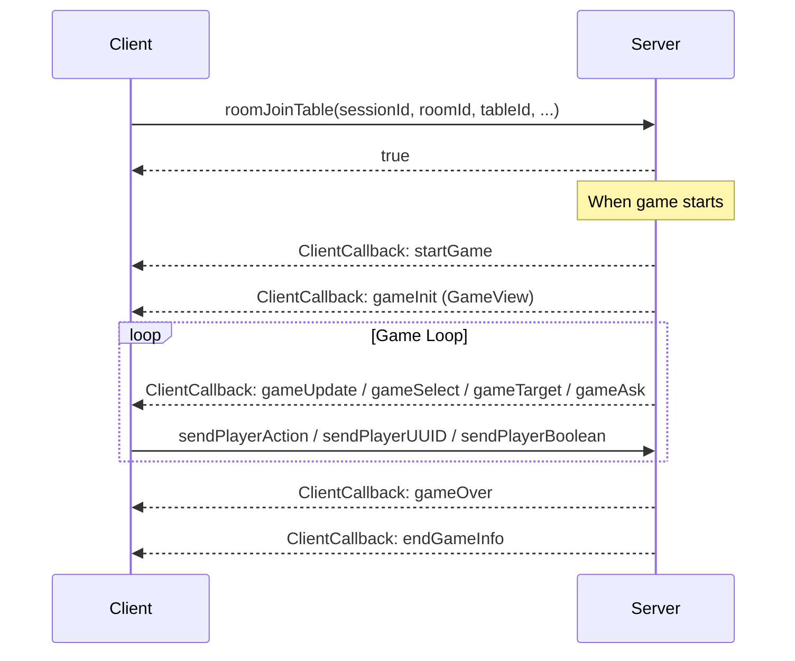

# XMage Web Client Implementation Plan

## Overview

This document provides a comprehensive implementation plan for building a web client for XMage. The backend WebSocket API has been implemented in `WebSocketServerImpl.java` and is ready for client integration.

---

## 1. Technology Stack

### Recommended Stack

| Component | Technology | Rationale |
|-----------|------------|-----------|
| **Framework** | **Vite + React** | Fast development, excellent HMR, simpler than Next.js for SPA |
| **Language** | **TypeScript** | Type safety is critical for the polymorphic API |
| **State Management** | **Zustand** | Lightweight, perfect for game state; works well with immutable updates |
| **Styling** | **Tailwind CSS** | Rapid UI development, consistent design system |
| **WebSocket** | Native `WebSocket` + custom wrapper | Full control over reconnection and message handling |
| **Validation** | **Zod** | Runtime validation of server responses |
| **Testing** | **Vitest** + **Playwright** | Unit and E2E testing |

### Alternative Stacks

- **Vue 3 + Pinia**: Viable alternative if team prefers Vue
- **Next.js**: If SSR/SEO is needed (unlikely for game client)
- **SolidJS**: For maximum performance (less ecosystem support)

---

## 2. Architecture

### 2.1 Service Layer

```
┌─────────────────────────────────────────────────────────────┐
│                       React Components                       │
├─────────────────────────────────────────────────────────────┤
│                        Zustand Stores                        │
│  ┌──────────┐  ┌───────────┐  ┌──────────┐  ┌────────────┐  │
│  │ Session  │  │   Lobby   │  │   Game   │  │    Chat    │  │
│  │  Store   │  │   Store   │  │   Store  │  │   Store    │  │
│  └──────────┘  └───────────┘  └──────────┘  └────────────┘  │
├─────────────────────────────────────────────────────────────┤
│                       Service Layer                          │
│  ┌───────────────────────────────────────────────────────┐  │
│  │                   WebSocketService                     │  │
│  │  - connect(url)                                       │  │
│  │  - send(method, params): Promise<result>              │  │
│  │  - onCallback(handler)                                │  │
│  │  - ping()                                             │  │
│  └───────────────────────────────────────────────────────┘  │
└─────────────────────────────────────────────────────────────┘
```

### 2.2 Core Services

#### WebSocketService (Singleton)

```typescript
class WebSocketService {
  private ws: WebSocket | null = null;
  private requestId = 0;
  private pendingRequests = new Map<number, { resolve, reject, timeout }>();
  private callbackHandlers: ((callback: ClientCallback) => void)[] = [];

  connect(url: string): Promise<void>;
  disconnect(): void;
  send<T>(method: string, params: unknown[]): Promise<T>;
  onCallback(handler: (callback: ClientCallback) => void): () => void;
  
  private handleMessage(event: MessageEvent): void;
  private startPingInterval(): void;
}
```

**Key Features:**
- Automatic reconnection with exponential backoff
- Request/response correlation via `id` field
- Callback dispatch to registered handlers
- Ping/pong keep-alive (every 30 seconds)
- Request timeout handling (default: 30 seconds)

#### SessionManager

```typescript
interface SessionState {
  sessionId: string | null;
  userName: string | null;
  userData: UserData | null;
  isConnected: boolean;
  mainRoomId: UUID | null;
}

const useSessionStore = create<SessionState & SessionActions>((set, get) => ({
  // State
  sessionId: localStorage.getItem('sessionId') || crypto.randomUUID(),
  userName: null,
  userData: null,
  isConnected: false,
  mainRoomId: null,
  
  // Actions
  login: async (userName: string, password: string) => { ... },
  register: async (userName: string, password: string, email: string) => { ... },
  setUserData: async (userData: UserData) => { ... },
  logout: () => { ... },
}));
```

#### GameManager

```typescript
interface GameState {
  gameId: UUID | null;
  gameView: GameView | null;
  pendingAction: PendingAction | null;
  isMyTurn: boolean;
  isWatching: boolean;
}

type PendingAction = 
  | { type: 'ask'; message: string }
  | { type: 'target'; validTargets: UUID[] }
  | { type: 'chooseAbility'; abilities: AbilityPickerView }
  | { type: 'choosePile'; piles: unknown }
  | { type: 'mana'; message: string }
  // ... more action types
```

### 2.3 Component Structure

```
src/
├── components/
│   ├── common/
│   │   ├── Button.tsx
│   │   ├── Modal.tsx
│   │   ├── Card.tsx              # Generic card renderer
│   │   └── ManaSymbols.tsx
│   ├── login/
│   │   ├── LoginPage.tsx
│   │   ├── RegisterForm.tsx
│   │   └── ServerSelector.tsx
│   ├── lobby/
│   │   ├── LobbyPage.tsx
│   │   ├── TableList.tsx
│   │   ├── TableRow.tsx
│   │   ├── CreateTableDialog.tsx
│   │   └── JoinTableDialog.tsx
│   ├── game/
│   │   ├── GamePage.tsx
│   │   ├── Battlefield.tsx
│   │   ├── PlayerPanel.tsx
│   │   ├── Hand.tsx
│   │   ├── Stack.tsx
│   │   ├── Graveyard.tsx
│   │   ├── Exile.tsx
│   │   ├── ManaPool.tsx
│   │   ├── PhaseIndicator.tsx
│   │   ├── GameLog.tsx
│   │   └── dialogs/
│   │       ├── AskDialog.tsx
│   │       ├── TargetDialog.tsx
│   │       ├── ChoiceDialog.tsx
│   │       ├── AbilityPicker.tsx
│   │       └── ManaPaymentDialog.tsx
│   ├── chat/
│   │   ├── ChatPanel.tsx
│   │   └── ChatMessage.tsx
│   └── deck/
│       ├── DeckEditor.tsx
│       └── CardSearch.tsx
├── services/
│   ├── WebSocketService.ts
│   ├── CardImageService.ts
│   └── AudioService.ts
├── stores/
│   ├── sessionStore.ts
│   ├── lobbyStore.ts
│   ├── gameStore.ts
│   └── chatStore.ts
├── types/
│   ├── api.ts                    # WebSocket API types
│   ├── game.ts                   # Game state types
│   └── models.ts                 # Data model types
└── utils/
    ├── mana.ts                   # Mana cost parsing
    ├── zones.ts                  # Zone utilities
    └── validation.ts             # Zod schemas
```

---

## 3. Data Flow & Connection Sequence

### 3.1 Initial Connection Flow



### 3.2 Join Game Flow



### 3.3 Callback Processing

All server push messages are `ClientCallback` objects:

```typescript
interface ClientCallback {
  messageId: number;
  method: string;
  objectId: UUID | null;
  data: unknown;  // Type depends on method
}
```

**Critical Callback Types:**

| Method | Data Type | Action Required |
|--------|-----------|-----------------|
| `gameInit` | `GameView` | Initialize game state |
| `gameUpdate` | `GameView` | Update game state |
| `gameInform` | `GameView` | Update state + show message |
| `gameSelect` | `GameView` | Player must select an object |
| `gameTarget` | `GameView` | Player must select targets |
| `gameAsk` | `GameView` | Yes/No dialog required |
| `gameChooseAbility` | `AbilityPickerView` | Modal ability picker |
| `gamePlayMana` | `GameView` | Mana payment required |
| `gameOver` | `GameEndView` | Show game end screen |
| `chatMessage` | Various | Display chat message |

### 3.4 Polymorphic Data Handling Strategy

The `data` field varies by method. Use discriminated unions:

```typescript
type CallbackData = 
  | { method: 'gameUpdate'; data: GameView }
  | { method: 'gameAsk'; data: GameView }
  | { method: 'gameError'; data: string }
  | { method: 'chatMessage'; data: ChatMessageData }
  // ... more types

function handleCallback(callback: ClientCallback) {
  switch (callback.method) {
    case 'gameUpdate':
    case 'gameInit':
    case 'gameInform':
    case 'gameSelect':
    case 'gameTarget':
    case 'gameAsk':
    case 'gamePlayMana':
      if (isGameView(callback.data)) {
        gameStore.getState().updateGameView(callback.data);
      }
      break;
    case 'gameError':
      toast.error(callback.data as string);
      break;
    // ... more cases
  }
}
```

---

## 4. Implementation Roadmap

### Phase 1: Foundation (Week 1-2)

**Goal:** Basic login and lobby viewing

- [ ] Project setup (Vite + React + TypeScript + Tailwind)
- [ ] Implement `WebSocketService` with reconnection logic
- [ ] Create session store with `connectUser` and `connectSetUserData`
- [ ] Build `LoginPage` with login/register forms
- [ ] Build basic `LobbyPage` showing tables list
- [ ] Implement `ping` keep-alive

**Milestone:** User can log in and see the table list.

### Phase 2: Lobby & Chat (Week 3)

**Goal:** Full lobby functionality and chat

- [ ] Implement `roomGetAllTables` polling or subscription
- [ ] Build `TableList` component with filtering/sorting
- [ ] Build `CreateTableDialog` with `MatchOptions` form
- [ ] Build `JoinTableDialog` with deck selection
- [ ] Implement chat panel (`chatJoin`, `chatSendMessage`, `chatMessage` callbacks)
- [ ] Handle `joinedTable` callback

**Milestone:** User can create/join tables and chat.

### Phase 3: Game Core - Read Only (Week 4-5)

**Goal:** Display game state without interaction

- [ ] Build `GamePage` layout
- [ ] Implement `Battlefield` component with permanent rendering
- [ ] Implement `Hand` component
- [ ] Implement `Stack` component
- [ ] Implement `PlayerPanel` (life, mana pool, library count)
- [ ] Handle `gameInit` and `gameUpdate` callbacks
- [ ] Build `PhaseIndicator`
- [ ] Implement card image loading (Scryfall or local)

**Milestone:** User can watch a game in real-time.

### Phase 4: Basic Game Actions (Week 6-7)

**Goal:** Core gameplay interactions

- [ ] Implement `sendPlayerAction` for priority passes
- [ ] Build `AskDialog` for `gameAsk` (Yes/No)
- [ ] Build `ChoiceDialog` for `gameChooseChoice`
- [ ] Implement basic targeting (`sendPlayerUUID`)
- [ ] Handle `gameSelect` for card selection
- [ ] Add keyboard shortcuts (F2, F4, F6, etc.)

**Milestone:** User can play a simple game (lands, creatures, combat).

### Phase 5: Advanced Interactions (Week 8-9)

**Goal:** Complex game mechanics

- [ ] Implement `ManaPaymentDialog` for `gamePlayMana` / `gamePlayXMana`
- [ ] Build `AbilityPicker` for `gameChooseAbility`
- [ ] Handle `gameChoosePile`
- [ ] Implement `gameSelectAmount` and `gameSelectMultiAmount`
- [ ] Build combat assignment UI (attackers/blockers)
- [ ] Handle `CombatGroupView` rendering

**Milestone:** User can play most standard games.

### Phase 6: Polish & Advanced Features (Week 10+)

**Goal:** Full feature parity and UX polish

- [ ] Build `DeckEditor` with deck import/export
- [ ] Implement `Graveyard` and `Exile` viewers
- [ ] Add revealed/looked-at card displays
- [ ] Implement game replay viewing
- [ ] Add sound effects and animations
- [ ] Implement sideboard dialog
- [ ] Add tournament support (`roomCreateTournament`, draft flow)
- [ ] Build settings panel for `UserData` preferences
- [ ] Performance optimization (virtualization, memoization)
- [ ] Accessibility improvements
- [ ] Mobile responsiveness

**Milestone:** Production-ready web client.

---

## 5. Key Technical Challenges

### 5.1 Polymorphic Data

**Challenge:** The `ClientCallback.data` field varies by method.

**Solution:**
- Use TypeScript discriminated unions
- Create Zod schemas for each callback type
- Use type guards for runtime checking

```typescript
const GameViewSchema = z.object({
  players: z.array(PlayerViewSchema),
  phase: z.nativeEnum(TurnPhase),
  // ...
});

function parseGameView(data: unknown): GameView {
  return GameViewSchema.parse(data);
}
```

### 5.2 Performance with Large GameViews

**Challenge:** Server sends the entire `GameView` on every update, which can be 100KB+.

**Solutions:**
1. **Immutable state updates:** Use Zustand with Immer for efficient diffing
2. **Memoized components:** React.memo on card components
3. **Virtualization:** Use `react-window` for large lists (graveyard, library views)
4. **Shallow comparison:** Only re-render when relevant data changes

```typescript
const usePlayerLife = (playerId: UUID) => 
  useGameStore(state => 
    state.gameView?.players.find(p => p.playerId === playerId)?.life
  );
```

### 5.3 Card Image Management

**Challenge:** Loading images for potentially hundreds of unique cards.

**Solutions:**
1. **Scryfall API:** Use `https://api.scryfall.com/cards/{set}/{number}?format=image`
2. **Lazy loading:** Only load visible card images
3. **Preloading:** Preload opponent's battlefield on game start
4. **Fallback:** Show card frame with text if image fails

```typescript
function getCardImageUrl(card: CardView): string {
  const setCode = card.expansionSetCode.toLowerCase();
  const number = card.cardNumber;
  return `https://api.scryfall.com/cards/${setCode}/${number}?format=image&version=normal`;
}
```

### 5.4 User Preferences (F-Keys)

**Challenge:** Synchronizing local F-key settings with server.

**Solution:**
- Store locally and sync via `connectSetUserData`
- Update `UserData.userSkipPrioritySteps` on toggle
- Send updated preferences immediately

```typescript
const toggleAutoYield = async () => {
  const userData = { ...sessionStore.getState().userData };
  userData.userSkipPrioritySteps.stopOnAllMainPhases = !userData.userSkipPrioritySteps.stopOnAllMainPhases;
  await wsService.send('connectSetUserData', [userName, sessionId, userData, version, userId]);
  sessionStore.setState({ userData });
};
```

### 5.5 Reconnection Handling

**Challenge:** Graceful handling of disconnects during a game.

**Solution:**
1. Detect disconnect → show overlay
2. Attempt reconnection with exponential backoff
3. On reconnect: re-authenticate with same `sessionId`
4. Server will resume pushing game state

```typescript
class WebSocketService {
  private reconnectAttempts = 0;
  private maxReconnectAttempts = 10;
  
  private scheduleReconnect() {
    const delay = Math.min(1000 * Math.pow(2, this.reconnectAttempts), 30000);
    setTimeout(() => this.connect(this.url), delay);
    this.reconnectAttempts++;
  }
}
```

---

## 6. Testing Strategy

### Unit Tests
- Store logic (Zustand stores)
- Utility functions (mana parsing, zone helpers)
- WebSocket message parsing

### Integration Tests
- Mock WebSocket server
- Test full login flow
- Test game state updates

### E2E Tests (Playwright)
- Full game flow with real server
- Visual regression testing

---

## 7. Related Documentation

- [WebSocketAPI.md](./WebSocketAPI.md) - Full API specification
- [WebClientDataModels.md](./WebClientDataModels.md) - TypeScript type definitions
- Java source: `Mage.Server/src/main/java/mage/server/websocket/WebSocketServerImpl.java`
- Java source: `Mage.Common/src/main/java/mage/interfaces/MageServer.java`
